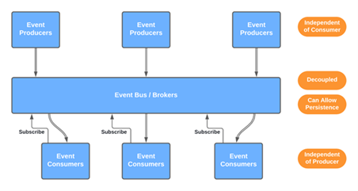

# Messaging/Event Driven Architecture Guide

## 1. What is Messaging/Event Drvien Architecture

* A design where systems communicate by sending and receiving messages.
* Enables asynchronous communication, loose coupling, and scalability.

  

It is worth mentioning that Messaging Architecture is not the same as Event Driven Architecture. However, they are very similar in design/implementation and are often used as interhcangable terms.

### Messaging vs. Event-Driven Architecture

| **Aspect**                 | **Messaging Architecture**                                         | **Event-Driven Architecture**                                     |
| -------------------------- | ------------------------------------------------------------------ | ----------------------------------------------------------------- |
| **Primary Goal**           | Decouple communication between systems via messages                | React to events or state changes in the system                    |
| **Message Type**           | **Command** (instruction to do something)                          | **Event** (fact about something that happened)                    |
| **Initiator Intent**       | Sender wants a specific **action** to occur                        | Publisher just **notifies** about an event, doesn’t expect action |
| **Message Direction**      | Often **point-to-point** (queues)                                  | Often **publish-subscribe** (multiple consumers)                  |
| **Examples**               | "CreateOrder", "SendEmail", "GenerateInvoice"                      | "OrderCreated", "UserSignedUp", "FileUploaded"                    |
| **Coupling**               | Loosely coupled but implies **intent**                             | Loosely coupled and **informational**                             |
| **Delivery Guarantee**     | Often **guaranteed delivery** with retry logic (e.g., Service Bus) | Best-effort or at-least-once delivery (e.g., Event Grid, Kafka)   |
| **Consumer Behavior**      | Consumer is expected to **act on** the message                     | Consumers **decide how to react** to the event                    |
| **Control Flow**           | Sender **controls** what needs to happen                           | Receiver(s) **decide** what to do based on event type             |
| **Latency Requirements**   | Often used for **background jobs or workflows**                    | Often used for **real-time reactions**                            |
| **Common Protocols/Tools** | Azure Service Bus, RabbitMQ, MSMQ                                  | Azure Event Grid, Kafka, AWS EventBridge, Event Hubs              |

### Summary

Messaging Architecture:
* Is about reliable commands and task delegation.
* Use when the sender wants something to happen.

Event-Driven Architecture:
* Is about informing others that something happened.
* Use when you want to notify many systems to react independently.

## 2. Why Messaging/Event Driven Designs?

Messaging brings several architectural and operational advantages to modern software systems:

* **Improves fault tolerance:** Services can continue working even if a downstream service is temporarily unavailable.

* **Reduces system coupling:** Systems don't need to know each other's internals — they only exchange messages.

* **Enables retry and resilience:** Failed operations can be retried automatically without losing data.

* **Supports buffering and load leveling:** Prevents overloading services by queuing requests during traffic spikes.

* **Ideal for background and asynchronous processing:** Offloads non-critical or long-running tasks (e.g., email sending, PDF generation).

* **Improves scalability:** Consumers can be scaled independently to match workload.

* **Decouples failure domains:** One service crashing won’t immediately impact the others — failures are isolated.

* **Auditability and traceability:** Messages can be logged, replayed, and traced end-to-end.

* **Supports eventual consistency:** Particularly useful in distributed systems where real-time consistency isn't necessary.

* **Eases integration between heterogeneous systems:** Useful for bridging legacy and modern systems, or across technology stacks.

* **Facilitates parallel processing:** Multiple consumers can process messages concurrently for higher throughput.

## 3. Messaging vs HTTP/RPC

| Protocol   | Characteristics                                  | Use Case                                |
| ---------- | ------------------------------------------------ | --------------------------------------- |
| HTTP / RPC | Synchronous, tightly coupled, brittle under load | Real-time API calls, request/response   |
| Messaging  | Asynchronous, decoupled, resilient               | Workflows, queues, events, integrations |

## 4. Real-World Messaging Examples

* Point-of-sale (POS) systems sending sales data.
* E-commerce order pipelines.
* IoT telemetry streaming. (Ring Dorbell)
* Background job triggers (e.g., emails, alerts).

## 5. Core Concepts

* **Message Contracts / Payloads**: Defines structure (JSON, XML, etc.), includes schema versioning.
* **Producers and Consumers**: Senders and receivers of messages; often decoupled.
* **Delivery Guarantees**:

  * *At-most-once*: No retries, might lose messages.
  * *At-least-once*: Ensures delivery but may duplicate.
  * *Exactly-once*: Requires deduplication/idempotency logic.

## 6. Messaging Patterns (High-Level)

* **Queue-Based (Point-to-Point)**: One sender, one receiver.
* **Publish/Subscribe**: One sender, multiple subscribers.
* **Event-Driven Architecture (EDA)**: Systems react to events asynchronously.
* **Choreography vs Orchestration**: Distributed coordination vs central controller.

## 7. Messaging in Azure

### Available Azure Services:

| Service        | Description                                          |
| -------------- | ---------------------------------------------------- |
| Service Bus    | Enterprise queues and pub/sub (topics)               |
| Event Grid*    | Lightweight eventing, integrates with Azure services |
| Event Hubs*    | High-throughput event ingestion (e.g., telemetry)    |
| Storage Queues | Simple, cost-effective queueing option               |

* NOTE: EventHubs supports Kafta styled Event Streaming. Event Streaming is a methodolgy and implementation that allows systems to restart/replay events from a specific point in time (index) as long as the events TTL has not expired.

### Azure Messaging Services Compared

| Feature / Purpose           | **Service Bus**                                              | **Event Grid**                                              | **Event Hubs**                                              |
| --------------------------- | ------------------------------------------------------------ | ----------------------------------------------------------- | ----------------------------------------------------------- |
| **Primary Use Case**        | Enterprise messaging, app-to-app communication               | Event-driven architecture, event notifications              | High-throughput data ingestion and streaming                |
| **Messaging Pattern**       | Queues and Topics (Pub/Sub)                                  | Pub/Sub for lightweight events                              | Streaming with partitions (distributed log)                 |
| **Typical Scenarios**       | - Order processing<br>- Command queues<br>- Background tasks | - Blob created<br>- Resource updates<br>- Trigger workflows | - IoT telemetry<br>- App logs<br>- Clickstreams             |
| **Delivery Model**          | Pull (via queues or topics)                                  | Push (to webhooks, Functions, etc.)                         | Pull (consumer groups, checkpointing)                       |
| **Ordering Support**        | Yes (Sessions)                                               | No                                                          | Yes (within a partition)                                    |
| **Throughput**              | Moderate                                                     | Low to moderate                                             | Very high (millions of events/sec)                          |
| **Latency**                 | Low                                                          | Near real-time                                              | Low (optimized for throughput)                              |
| **Retention**               | Up to 14 days                                                | 24 hours (default)                                          | Up to 7 days (more with Capture)                            |
| **Replay / Resend Support** | Manual DLQ handling                                          | No (stateless, one-time events)                             | Yes (checkpointing / offset-based)                          |
| **Message Size**            | Up to 256 KB (Standard), 1 MB (Premium)                      | Up to 1 MB                                                  | Up to 1 MB                                                  |
| **Security**                | RBAC, SAS, Managed Identity                                  | Azure AD, SAS, Webhook auth                                 | RBAC, SAS, Managed Identity                                 |
| **Protocols**               | AMQP, HTTPS                                                  | HTTPS (event schema + metadata)                             | AMQP, Kafka, HTTPS                                          |
| **Client SDKs**             | .NET, Java, Python, etc.                                     | Lightweight; supports direct HTTP calls                     | .NET, Java, Kafka SDKs, Python, etc.                        |
| **Built-in Integrations**   | With Azure Functions, Logic Apps, durable APIs               | Deep Azure integration (e.g., Blob, Resource Group events)  | Event Hubs Capture, Azure Stream Analytics, Kafka ecosystem |
| **Pricing Model**           | Based on operations, message size, and delivery              | Per million operations                                      | Based on throughput units and ingress/egress                |


### Supporting Services:

* **Azure Functions**: Event-driven compute for queue/event processing.
* **Logic Apps / Data Factory**: Workflow orchestration and ETL automation.
* **App Services**: Can act as API endpoints that send or receive messages.
* **Container Services**: Can act as long running compute that send or receive messages.

## 8. Recommendations for Message-Driven Architecture

* Use queues to decouple services.
* Use topics for popular data streams where multiple systems have an interest in the data
* Trigger Azure Functions with Service Bus or Event Grid.
* Use Data Factory for orchestration and movement.
* Begin with one area (e.g., ETL or alerting) to modernize incrementally.

### Example Flows:

```
* On-prem app → Azure Service Bus → Function App → Blob Storage → Email Notification
* Azure Log Monitor → EventGrid → Actions → notifications (this is native log analytics, monitoring and notifications)
* Timer → {Service Bus/EventGrid/EventHub} → Function App
```

## 9. Azure Function Triggers

Azure provides a number of trigger types that allow you to develop message/event based systems. As previously noted  

### Messaging & Eventing Triggers

| Trigger Type              | Description                                                              |
| ------------------------- | ------------------------------------------------------------------------ |
| **HTTP Trigger**          | Responds to HTTP requests (GET, POST, etc.). Ideal for APIs or webhooks. |
| **Service Bus Trigger**   | Listens to Service Bus queues or topics. Great for enterprise messaging. |
| **Event Grid Trigger**    | Responds to events from Azure Event Grid (e.g., Blob created).           |
| **Event Hub Trigger**     | Processes high-throughput event streams (e.g., telemetry, logs).         |
| **Queue Storage Trigger** | Responds to messages in Azure Storage queues.                            |

### Storage & Data Triggers

| Trigger Type             | Description                                                       |
| ------------------------ | ----------------------------------------------------------------- |
| **Blob Storage Trigger** | Fires when a blob is created or updated in Azure Blob Storage.    |
| **Cosmos DB Trigger**    | Reacts to inserts/updates in a Cosmos DB container (Change Feed). |
| **SQL Database Trigger** | (Preview) Reacts to changes in Azure SQL DB via Change Tracking.  |

### Time-Based Trigger

| Trigger Type      | Description                                                        |
| ----------------- | ------------------------------------------------------------------ |
| **Timer Trigger** | Schedules the function to run at specific times (CRON expression). |

### Specialized Triggers

| Trigger Type                         | Description                                                 |
| ------------------------------------ | ----------------------------------------------------------- |
| **Durable Functions Triggers**       | Supports orchestrator, activity, and entity triggers.       |
| **SignalR Trigger**                  | (Used with bindings) Enables real-time messaging scenarios. |
| **Kafka Trigger (via extension)**    | Enables event-driven functions from Apache Kafka.           |
| **Custom Binding / Webhook Handler** | Custom integration with external systems or SaaS platforms. |


## 10. Demo / Examples

In this repository you will find various code examples that provide not only coding context but a look into the symantics of the various types messaging services and how they react based on the given architectural design.

* [Service Bus Examples](./servicebus/)

**NOTE:** Check out the demo README page here: [EXAMPLES](./EXAMPLES.md)
## 11. Messaging Operations (Ops)

* **Monitoring**: Azure Monitor, Application Insights, Service Bus metrics.
* **Failures**: Handle with retries, DLQs (dead-letter queues), and alerts.
* **Retries**: Built-in in Functions/Logic Apps; configure max attempts and backoff.
* **Idempotency**: Use message IDs or hashes to avoid duplicate processing.

## 12. Security Considerations

* Encrypt messages in transit (TLS).
* Use **Managed Identities** and **Azure RBAC**.
* Leverage **Shared Access Policies** for scoped access control.

## 13. Final Thoughts

* Messaging is a practical modernization step, especially for legacy apps.
* Start with a hybrid approach.
* Focus on pain points: long-running processes, integrations, or batch systems.
